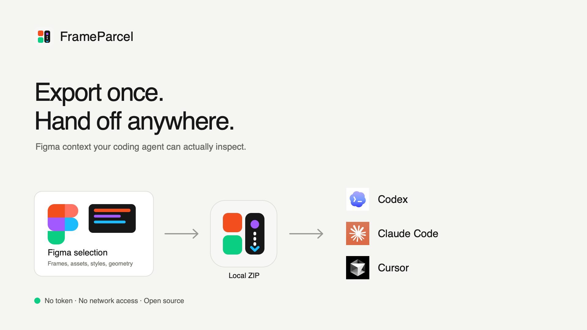
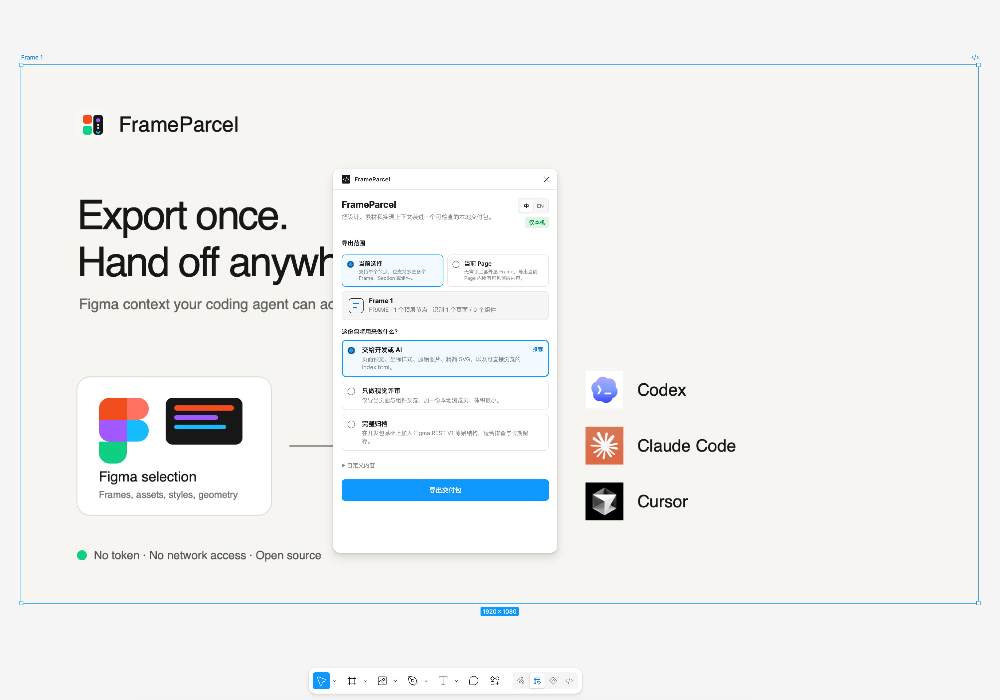
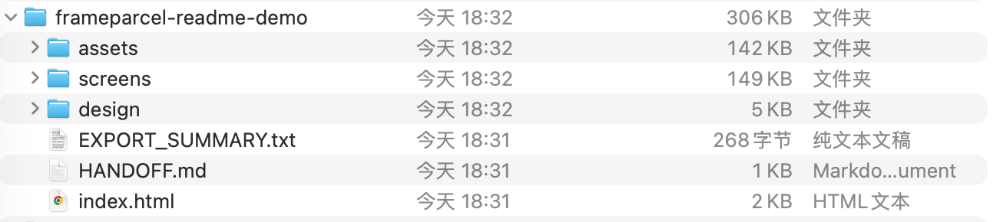

# FrameParcel

<p align="center">
  
</p>

<p align="center"><strong>Export once. Hand off anywhere.</strong></p>

FrameParcel turns a Figma selection or Page into one local, inspectable ZIP for developers and coding agents. It keeps the visual reference, implementation structure, and reusable assets together—without an API token, hosted service, analytics, or design upload.

<p align="center"><code>Local only</code> · <code>No token</code> · <code>No network permission</code> · <code>MIT</code></p>

## See the real workflow

### 1. Choose the export scope in Figma

Choose one node, multiple Frames/Sections/Components, or the current Page. The recommended preset includes the useful implementation context by default.



### 2. Open the package anywhere

This is an actual package exported from the public FrameParcel demo frame and expanded in Finder. The screenshot contains no private design file or personal path.



```text
frameparcel-handoff/
├── index.html                 # offline visual browser
├── HANDOFF.md                 # human + agent reading order
├── EXPORT_SUMMARY.txt
├── design/node-index.json     # geometry, styles, components, variables
├── screens/                   # 2× full-surface previews
├── components/                # smaller top-level fragments
└── assets/                    # original images, smart SVGs, manifest
```

The demo package above was checked with both FrameParcel's validator and macOS ZIP integrity testing.

## What you get

| Need | File | Why it is there |
| --- | --- | --- |
| Visual truth | `index.html`, `screens/`, `components/` | Browse the design offline and compare implementation against 2× previews. |
| Layout | `design/node-index.json` | Relative and absolute geometry, Auto Layout, typography, paints, effects, components, and variables. |
| Reusable assets | `assets/images/`, `assets/svg/` | Original image-fill bytes and deduplicated visible icon compositions. |
| Reading order | `HANDOFF.md` | Tells a developer or coding agent which files are authoritative. |
| Deep archive | `design/rest-v1.json` | Optional raw Figma REST V1 structure for debugging or preservation. |

## Quick start

Use the Figma Community listing when it is available, or run the ready-to-use build included in this repository:

1. Download and extract the repository's GitHub source archive.
2. In **Figma Desktop**, import `manifest.json` from the development plugin menu.
3. Select design content, run **FrameParcel**, and choose **Export handoff package**.

No build step is required for normal use. For plugin development:

```bash
npm ci
npm run check
npm run build
npm run test:sandbox
```

## Presets and scope

| Preset | Best for | Contents |
| --- | --- | --- |
| **Development or AI** | Implementation and coding agents | Previews, node index, original images, smart SVGs, browser, guide. |
| **Visual review** | Product/design review | Previews, browser, guide; smallest package. |
| **Complete archive** | Debugging and preservation | Development package plus REST V1 JSON. |

Export the **current selection** (one or many nodes) or the **current Page**. Selecting one large Frame or Section also works: FrameParcel separates full screens from smaller component fragments automatically.

<details>
<summary><strong>Developer notes, validation, and boundaries</strong></summary>

## Validate an export

The validator accepts a ZIP or an extracted folder:

```bash
npm run validate-export -- /absolute/path/to/frameparcel-handoff.zip
npm run validate-export -- /absolute/path/to/extracted-folder
```

It checks required files, node geometry, previews, asset/SVG errors, the offline viewer, and the handoff guide.

## Built for humans and coding agents

- [`AGENTS.md`](AGENTS.md) is the canonical contributor guide.
- [`docs/export-contract.md`](docs/export-contract.md) defines the tool-neutral package contract.
- Generated `HANDOFF.md` files explain the package from visual truth to implementation detail.
- Claude Code, Codex, Cursor, or any file-reading agent can inspect the extracted folder; this does not imply vendor endorsement.

## Privacy and boundaries

- `networkAccess` is `none`; there is no account, telemetry, analytics, or API token.
- The generated `index.html` is self-contained and loads no remote resources.
- Font names are recorded, but licensed font files are never copied.
- Content outside the chosen scope is not exported.
- FrameParcel packages implementation context; it does not generate production code or replace review.

</details>

<details>
<summary><strong>中文说明</strong></summary>

FrameParcel 是一个完全本地运行的 Figma 设计交付插件。选中一个节点、多个 Frame / Section / 组件，或者直接选择当前 Page，就能导出一个可离线浏览的 ZIP。

默认的“交给开发或 AI”会包含页面预览、坐标与样式索引、原始图片、精简 SVG、`index.html` 和 `HANDOFF.md`。插件不需要 Figma Token、没有网络权限，也不会把设计稿上传到第三方服务。

如果只是做视觉评审，可以选择更小的“只做视觉评审”；只有调试或长期归档时，才需要导出完整 REST V1 JSON。

</details>

## License

MIT
